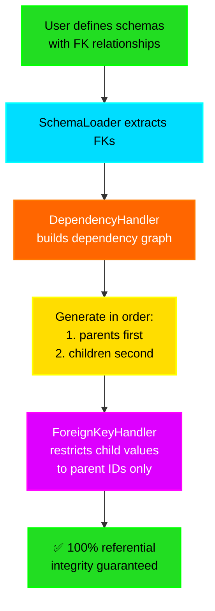
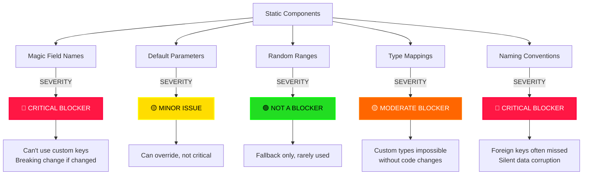
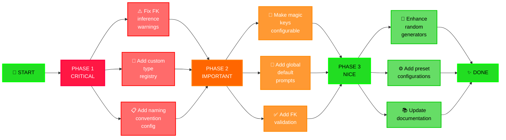

# 🔍 SYDA Design Analysis: Foreign Keys & Static Components

## Question 1: Why Foreign Keys Are Critical for Synthetic Data Generation

### 🎯 The Problem Without Foreign Keys

```
WITHOUT Foreign Key Management:
┌─────────────────┐     ┌──────────────┐
│ CUSTOMERS       │     │ ORDERS       │
│ id: 1,2,3,4,5   │     │ id: 1-50     │
│                 │     │ customer_id: │
│                 │     │ [1,2,3,7,99] │ ❌ PROBLEM!
└─────────────────┘     └──────────────┘

Result: Order with customer_id=99 when Customer 99 doesn't exist!
This is INVALID data that breaks databases and tests.
```

### 📊 Real-World Context: Why This Matters

**1. Database Integrity Constraints** 🔐
```sql
-- Database enforces referential integrity
CREATE TABLE orders (
    id INT PRIMARY KEY,
    customer_id INT NOT NULL,
    FOREIGN KEY (customer_id) REFERENCES customers(id)
);

-- INSERT fails if customer doesn't exist!
INSERT INTO orders VALUES (1, 99);  
-- ❌ Violates foreign key constraint
```

**2. Testing Scenarios** 🧪
```python
# You want to test: "Get all orders for Customer 5"
# Without FK management, Order table has customer_id=99
# Query returns 0 results → Test passes when it should fail!

# With proper FK management:
# All order.customer_id values exist in customers.id
# Test returns correct results → Test passes for RIGHT reason
```

**3. Data Analysis & Reporting** 📈
```python
# Reporting query: Total revenue by customer
SELECT 
    c.id, 
    c.name, 
    SUM(o.total) as revenue
FROM customers c
JOIN orders o ON c.id = o.customer_id
GROUP BY c.id;

# Without FK integrity:
# Some orders don't join (orphaned records)
# Report shows incomplete data
# Business decisions based on bad data!
```

**4. Complex Multi-Table Dependencies** 🏗️
```
WITHOUT Management:
    Users → ?
    Orders → ?
    OrderItems → ?
    Reviews → ?
    
    Chaos! No guaranteed order!

WITH Foreign Key Management:
    1. Users (no dependencies)
    2. Products (no dependencies)
    3. Orders (→ Users)
    4. OrderItems (→ Orders, Products)
    5. Reviews (→ Products, Users)
    
    Guaranteed correct order!
```

### ✅ Can You Create Synthetic Data Without Foreign Keys?

**YES - But with BIG limitations:**

```python
# ❌ Bad approach - No FK management
schemas = {
    'users': {'id': 'number', 'name': 'text'},
    'orders': {'id': 'number', 'user_id': 'number'}  # Just a number!
}

# Result: Random user_id values (1-1000) 
# Many don't match actual users (id 1-100)
# 90% orphaned records!

# ✅ Good approach - With FK management
schemas = {
    'users': {'id': 'number', 'name': 'text'},
    'orders': {
        'id': 'number', 
        'user_id': {'type': 'foreign_key'},  # Link to users
        '__foreign_keys__': {'user_id': ['users', 'id']}
    }
}

# Result: user_id values ONLY from actual users (1-100)
# 100% referentially correct!
```

### 🎯 SYDA's Foreign Key Approach



---

## Question 2: Static Components Analysis

Let me identify all hardcoded/static elements in SYDA:

### 📋 Static Components Found

#### **1. Magic Field Names (CRITICAL)**

```python
# In schema_loader.py
STATIC KEYS = {
    "__table_name__",
    "__table_description__", 
    "__foreign_keys__",
    "__template__",
    "__name__",
    "__depends_on__",
    "__template_source__",
    "__input_file_type__",
    "__output_file_type__"
}

# Problem: Hardcoded in multiple places
# If user wants to use "__my_custom_key__", system ignores it
```

```python
# In schema_loader.py, line 133
if "__foreign_keys__" in schema_dict:  # ❌ HARDCODED
    for fk_col, fk_ref in schema_dict["__foreign_keys__"].items():
        foreign_keys[fk_col] = (fk_ref[0], fk_ref[1])

# In schema_loader.py, line 258
schema_dict['__table_name__'] = table_name  # ❌ HARDCODED

# In schema_loader.py, line 352-355
# Assumes naming convention: user_id → users table
# What if convention is different? (e.g., user_pk, uid, etc.)
foreign_keys[column_name] = (target_entity + 's', 'id')  # ❌ Assumes plural + 's'
```

#### **2. Default Parameters (MODERATE)**

```python
# In generate.py, line 141-142
def generate_for_schemas(
    self,
    ...
    default_sample_size: int = 10,              # ❌ Hardcoded default
    default_prompt: str = "Generate synthetic data",  # ❌ Hardcoded default
    ...
):
```

**Impact:**
- ✅ Can be overridden by user
- ⚠️ But if user doesn't specify, defaults apply
- ❌ No way to change global defaults easily

#### **3. Random Value Generation (LOW)**

```python
# In utils.py, lines 33-50
def generate_random_value(field_type: str) -> Any:
    if field_type == 'integer':
        return random.randint(1, 1000)  # ❌ Fixed range
    elif field_type == 'float':
        return round(random.uniform(1.0, 1000.0), 2)  # ❌ Fixed range
    elif field_type == 'date':
        days = random.randint(0, 365 * 5)  # ❌ Fixed 5 year window
        return (date.today() - timedelta(days=days)).isoformat()
```

**Impact:**
- ✅ Rarely used (only for placeholders)
- ⚠️ Not configurable
- ✅ Good for fallback logic

#### **4. Type Mappings (MODERATE)**

```python
# In utils.py, lines 17-23
if field_type == 'integer':
    columns[field] = pd.Series(dtype='int64')  # ❌ HARDCODED
elif field_type == 'float':
    columns[field] = pd.Series(dtype='float64')  # ❌ HARDCODED
elif field_type == 'boolean':
    columns[field] = pd.Series(dtype='bool')  # ❌ HARDCODED
else:
    columns[field] = pd.Series(dtype='object')  # ❌ HARDCODED
```

**Impact:**
- ✅ Works for standard types
- ❌ No way to add custom type mappings
- ❌ User can't define "my_custom_type" without hacking code

#### **5. Naming Convention Inference (CRITICAL)**

```python
# In schema_loader.py, line 352-356
# TRIES TO GUESS FOREIGN KEYS FROM NAMING!
if column_name.endswith('_id'):  # ❌ Assumes _id suffix
    # Infer foreign key
    target_entity = column_name[:-3]  # Remove '_id'
    foreign_keys[column_name] = (target_entity + 's', 'id')
    # ❌ Assumes: user_id → users.id
    # What about: user_key → user.id? BREAKS!
```

#### **6. Output Format Defaults (LOW)**

```python
# In generate.py, line 285
def generate_for_schemas(
    self,
    ...
    output_format: str = 'csv'  # ❌ Default hardcoded
    ...
):
```

#### **7. Model Provider Defaults (MODERATE)**

```python
# In schemas.py, lines 15-16
provider: Literal["openai", "anthropic", "gemini", "azureopenai", "grok"] = "anthropic"
model_name: str = "claude-3-5-haiku-20241022"
```

---

### 🎯 Severity Analysis: Which Are Blockers?



---

### 📊 Should These Be Made Dynamic?

#### **1. Magic Field Names** 
**Current:** Hardcoded
```python
STATIC = "__foreign_keys__"
```

**Recommendation:** ⚠️ **KEEP STATIC** - Why?
```
✅ Prevents chaos (everyone uses same keys)
✅ Simplifies API
✅ No backward compatibility issues
❌ But make it documented/configurable at global level
```

**Better approach:**
```python
# Create a config file
syda/config.py:

class SydaConfig:
    RESERVED_KEYS = {
        "table_name": "__table_name__",
        "table_description": "__table_description__",
        "foreign_keys": "__foreign_keys__",
        # ... etc
    }
    
    @classmethod
    def set_key_prefix(cls, prefix="__"):
        # Allow customization if needed
        pass
```

#### **2. Type Mappings**
**Current:** Hardcoded in utils.py
```python
TYPE_MAP = {
    'integer': 'int64',
    'float': 'float64',
}
```

**Recommendation:** 🟡 **MAKE DYNAMIC** - Why?
```
❌ Current: Only standard types supported
❌ Can't add custom types (UUID, JSON, Enum, etc.)
✅ Should be registerable per instance
```

**Better approach:**
```python
# Allow custom type registration
generator = SyntheticDataGenerator(model_config=config)
generator.register_type('uuid', generator_func)
generator.register_type('phone', generator_func)

# Or global config
SydaConfig.register_type_mapping({
    'uuid': 'string',
    'phone': 'string',
    'json': 'object'
})
```

#### **3. Naming Convention for FK Inference**
**Current:** Hardcoded (`_id` suffix, plural table names)
```python
if column_name.endswith('_id'):
    target_table = column_name[:-3] + 's'  # ❌ Assumes plural
```

**Recommendation:** 🔴 **MUST MAKE DYNAMIC** - Why?
```
❌ CRITICAL: Silently creates wrong FK relationships!
❌ Companies use different naming conventions
❌ Leads to data corruption if inference fails
```

**Example Scenarios:**
```
Company A convention: user_id → users.id        ✅ Works
Company B convention: user_pk → user.id         ❌ Breaks
Company C convention: uid → users.id            ❌ Breaks
Company D convention: fk_user → users.id        ❌ Breaks
Company E convention: userId (camelCase)        ❌ Breaks
```

**Better approach:**
```python
# Option 1: User specifies naming convention
config = NamingConvention(
    fk_suffix="_id",
    table_plural_form="plural",  # or "singular"
    table_naming="snake_case"  # or "camelCase"
)
generator = SyntheticDataGenerator(
    model_config=model_config,
    naming_convention=config
)

# Option 2: Disable inference, require explicit definition
# Safer! Only process FKs explicitly defined in schema
generator = SyntheticDataGenerator(
    infer_foreign_keys=False  # Default should be False
)
```

#### **4. Default Sample Size**
**Current:** `default_sample_size: int = 10`

**Recommendation:** ✅ **OK AS IS** - Why?
```
✅ Can be overridden per schema
✅ Good for testing/prototyping
✅ Not a blocker
```

#### **5. Default Prompts**
**Current:** `"Generate synthetic data"`

**Recommendation:** 🟡 **MAKE CONFIGURABLE** - Why?
```
⚠️ Generic prompt = worse AI output
✅ Should have table-specific defaults
```

**Better approach:**
```python
DEFAULT_PROMPTS = {
    "users": "Generate realistic user profiles with names, emails, and valid addresses",
    "orders": "Generate e-commerce orders with realistic dates and amounts",
    # ... etc
}
```

---

## 🚨 Top 3 Issues to Fix

### **Issue #1: FK Inference Silent Failures** 🔴 CRITICAL
```python
# Problem
current_code = """
if column_name.endswith('_id'):
    # Silently infers FK relationship
    # If wrong, data is corrupted but no warning!
"""

# Solution: Make it explicit
better_code = """
# Option 1: Turn off inference by default
infer_fks = False  

# Option 2: Warn when inferring
if infer_fks and column_name.endswith('_id'):
    print(f"⚠️  WARNING: Inferring FK for {column_name}")
    print(f"   If wrong, explicitly define in schema!")
    
# Option 3: Require explicit definition
@requires_explicit_fk_definition
def generate_orders(...):
    pass
"""
```

### **Issue #2: No Custom Type Support** 🟡 MODERATE
```python
# Problem: Can't generate UUIDs, emails, phone numbers, etc.
schemas = {
    'users': {
        'id': 'uuid',  # ❌ Not supported!
        'email': 'email',  # ❌ Not supported!
        'phone': 'phone'  # ❌ Not supported!
    }
}

# Solution: Registry pattern
class TypeRegistry:
    def register(self, type_name, generator_func):
        self._types[type_name] = generator_func
        
    def generate(self, type_name):
        return self._types[type_name]()

generator.type_registry.register('uuid', lambda: str(uuid.uuid4()))
generator.type_registry.register('email', lambda: faker.email())
```

### **Issue #3: Magic Keys Not Configurable** 🟡 MODERATE
```python
# Problem: Can't change __foreign_keys__ to something else
# If API changes, breaks existing code

# Solution: Make it configurable globally
class SydaConfig:
    MAGIC_KEYS = {
        'foreign_keys': '__foreign_keys__',
        'table_name': '__table_name__',
        'table_description': '__table_description__',
    }
    
    @classmethod
    def configure(cls, **kwargs):
        for key, value in kwargs.items():
            cls.MAGIC_KEYS[key] = value
```

---

## 📋 Blocker vs Non-Blocker Summary

```
🔴 BLOCKERS (Should be fixed):
├─ FK Inference can silently fail
├─ No custom type support
└─ No naming convention configuration

🟡 MODERATE (Nice to have):
├─ Default prompts could be smarter
├─ Magic keys could be configurable
└─ Random value ranges could be customizable

🟢 NOT BLOCKERS:
├─ Default sample size (overridable)
├─ Output format (overridable)
└─ Model provider default (overridable)
```

---

## 🎯 Recommended Refactoring Priority



**Implementation Roadmap:**

| Phase | Priority | Items | Effort | Impact |
|-------|----------|-------|--------|--------|
| **1** | 🔴 CRITICAL | FK warnings, Type registry, Naming config | 2-3 days | **HIGHEST** - Fixes data corruption |
| **2** | 🟠 IMPORTANT | Magic keys config, Default prompts, FK validation | 3-4 days | **HIGH** - Better UX & stability |
| **3** | 🟢 NICE | Random generators, Presets, Docs | 2-3 days | **MEDIUM** - Polish & usability |

**Timeline:** ~7-10 days total for all improvements

---

## ✅ Conclusion

**Foreign Keys Are Essential Because:**
1. ✅ Database integrity constraints require valid references
2. ✅ Testing needs realistic data relationships
3. ✅ Reports must join correctly
4. ✅ Multi-table dependencies must be ordered properly
5. ✅ Cannot be created without it reliably

**Static Components Status:**
- 🔴 3 Critical issues need fixing
- 🟡 3 Moderate improvements recommended
- 🟢 3 Non-blocking design choices (fine as is)

**Should They Be Dynamic?**
- ✅ YES for: FK inference, type mappings, naming conventions
- ⚠️ MAYBE for: Magic keys, default prompts
- ✅ NO for: Reserved field names (keep structure stable)
