# 🚀 SYDA Complete Execution Flow (Visual Diagram)

## Full End-to-End Flow

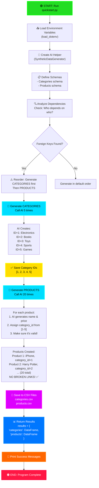

---

## Detailed Step-by-Step Breakdown

### **PHASE 1: Initialization** 🔧

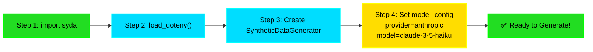

**What Happens:**
- Lines 1-6: Import the library
- Line 8: `load_dotenv()` - loads your API key from `.env` file
- Lines 12-18: Create the AI helper with settings

---

### **PHASE 2: Define Schemas** 📋

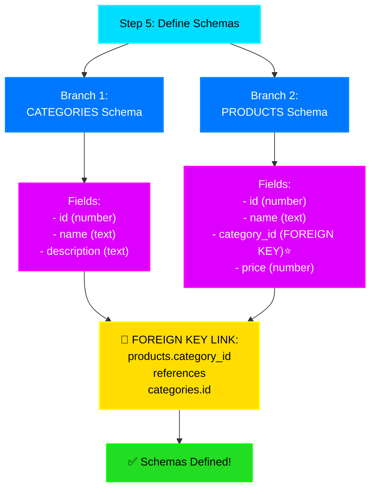

**What Happens:**
- Lines 20-45: Define categories table structure
- Lines 47-69: Define products table structure
- Line 50: `__foreign_keys__` - THIS IS THE KEY! 🔑

---

### **PHASE 3: Dependency Analysis** 🔍

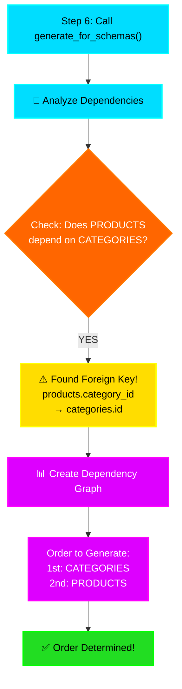

**Why This Matters:**
- If you generate products FIRST, you won't know which category IDs exist!
- SYDA automatically figures out the right order

---

### **PHASE 4: Generate Categories** 🎯

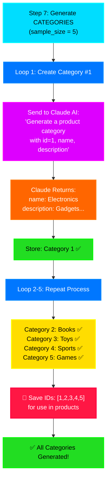

**Output After This Phase:**
```csv
id, name, description
1, Electronics, Gadgets and devices...
2, Books, Written stories and guides...
3, Toys, Playthings for children...
4, Sports, Athletic equipment...
5, Games, Board games and video games...
```

---

### **PHASE 5: Generate Products** 🛍️

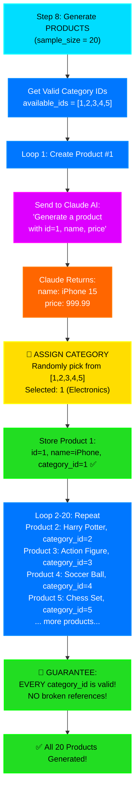

**Output After This Phase:**
```csv
id, name, category_id, price
1, iPhone 15, 1, 999.99
2, Harry Potter Book, 2, 15.99
3, Action Figure, 3, 29.99
4, Soccer Ball, 4, 49.99
5, Chess Set, 5, 34.99
6, MacBook Pro, 1, 1299.99
7, The Hobbit, 2, 12.99
... (20 total products)
```

**Notice:** Every `category_id` (1-5) is valid! No `category_id: 99` problems! ✅

---

### **PHASE 6: Save Output** 💾

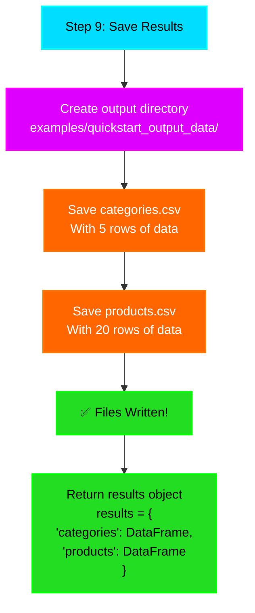

**What's Created:**
```
examples/quickstart_output_data/
├── categories.csv  (5 rows)
└── products.csv    (20 rows)
```

---

### **PHASE 7: Success & End** 🎉

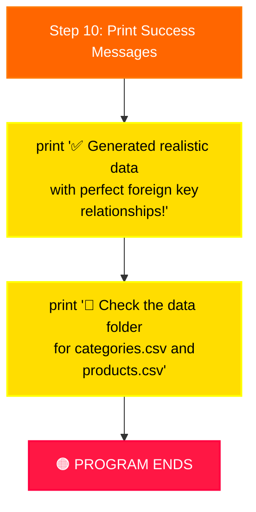

---

## Complete Timeline View

```mermaid
timeline
    title Complete SYDA Execution Timeline
    
    section Startup
        00:00 : Load .env file : Create AI Helper
        00:05 : Ready!
    
    section Setup
        00:10 : Define Categories Schema
        00:15 : Define Products Schema
        00:20 : Schemas Complete
    
    section Analysis
        00:25 : Analyze Dependencies
        00:30 : Found Foreign Key! : Products → Categories
        00:35 : Order Determined
    
    section Generation
        00:40 : Generate 5 Categories
        01:00 : All Categories Done
        01:05 : Generate 20 Products : Use Category IDs [1-5]
        02:00 : All Products Done
        02:05 : Verify No Broken Links ✅
    
    section Output
        02:10 : Save categories.csv
        02:15 : Save products.csv
        02:20 : Files Ready!
    
    section Finish
        02:25 : Print Success Message
        02:30 : Program Complete 🎉
```

---

## The Magic Moment (Foreign Key Handling)

```mermaid
graph LR
    A["Generated Categories"] --> B["Extract IDs: 1,2,3,4,5"]
    B --> C["Store in Memory"]
    C --> D["Generate Products"]
    D --> E["For Each Product..."]
    E --> F{"Need to assign<br/>category_id?"}
    F -->|YES| G["Pick random from [1,2,3,4,5]"]
    G --> H["✅ VALID!<br/>No broken links"]
    F -->|NO| I["Skip foreign key"]
    H --> J["Save Product"]
    I --> J
    
    style A fill:#00DDFF,stroke:#00FFFF,stroke-width:2px,color:#000000
    style B fill:#0077FF,stroke:#0088FF,stroke-width:2px,color:#FFFFFF
    style C fill:#DD00FF,stroke:#FF00FF,stroke-width:2px,color:#FFFFFF
    style D fill:#FF6600,stroke:#FF7700,stroke-width:2px,color:#FFFFFF
    style E fill:#FFDD00,stroke:#FFFF00,stroke-width:2px,color:#000000
    style F fill:#FFDD00,stroke:#FFFF00,stroke-width:2px,color:#000000
    style G fill:#22DD22,stroke:#00FF00,stroke-width:2px,color:#000000
    style H fill:#22DD22,stroke:#00FF00,stroke-width:2px,color:#000000
    style I fill:#00DDFF,stroke:#00FFFF,stroke-width:2px,color:#000000
    style J fill:#22DD22,stroke:#00FF00,stroke-width:2px,color:#000000
```

---

## Code Line by Line Execution Map

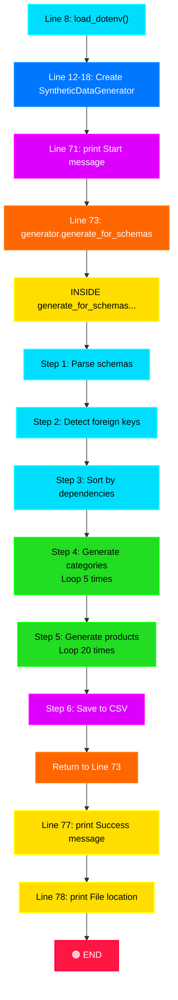

---

## Memory State During Execution

```
┌─────────────────────────────────────────┐
│         MEMORY STATE CHANGES            │
├─────────────────────────────────────────┤
│ After Load:                             │
│ ├─ API_KEY loaded ✅                    │
│ ├─ generator created ✅                 │
│                                         │
│ After Schema Definition:                │
│ ├─ categories_schema stored ✅          │
│ ├─ products_schema stored ✅            │
│ ├─ foreign_keys detected ✅             │
│                                         │
│ After Category Generation:              │
│ ├─ categories_df = [5 rows] ✅          │
│ ├─ category_ids = [1,2,3,4,5] ✅        │
│                                         │
│ After Product Generation:               │
│ ├─ products_df = [20 rows] ✅           │
│ ├─ All category_id values valid ✅      │
│                                         │
│ Final Results:                          │
│ ├─ results['categories'] ✅             │
│ ├─ results['products'] ✅               │
│ ├─ CSV files created ✅                 │
└─────────────────────────────────────────┘
```

---

## The Three Critical Checkpoints

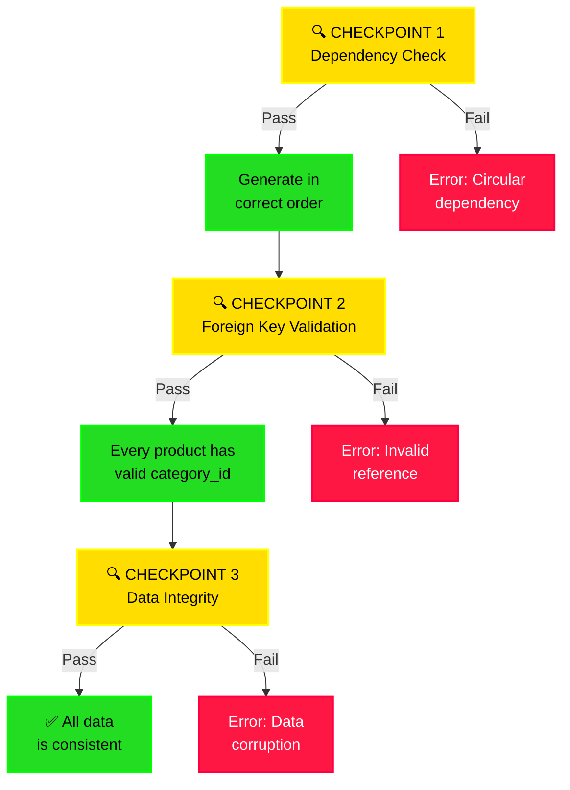

---

## Summary in One Picture

```
START
  ↓
[INIT] Load API & Create Generator
  ↓
[DEFINE] Create Schema Blueprints
  ↓
[ANALYZE] Find Dependencies (Foreign Keys)
  ↓
[GENERATE] Create Categories (5 rows)
  ↓
[STORE] Remember Category IDs [1-5]
  ↓
[GENERATE] Create Products (20 rows, use category IDs)
  ↓
[VALIDATE] Ensure No Broken References ✅
  ↓
[SAVE] Write CSV Files
  ↓
[SUCCESS] Print Messages & Return Results
  ↓
END 🎉
```

That's the complete flow! Every single step from clicking "Run" to having your CSV files! 🚀
