# 🏭 SYDA Production Application Flow (End-to-End Architecture)

This document explains the complete execution flow of the production-grade SYDA synthetic data generation library, from library initialization through final data output.

---

## 🎬 Complete System Architecture

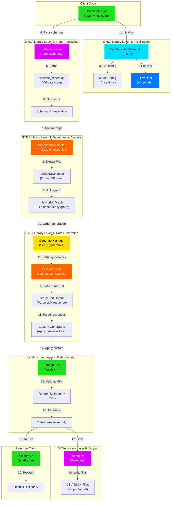

---

## 📊 Detailed Production Flow - Phase by Phase

### **PHASE 1: Library Initialization** 🚀

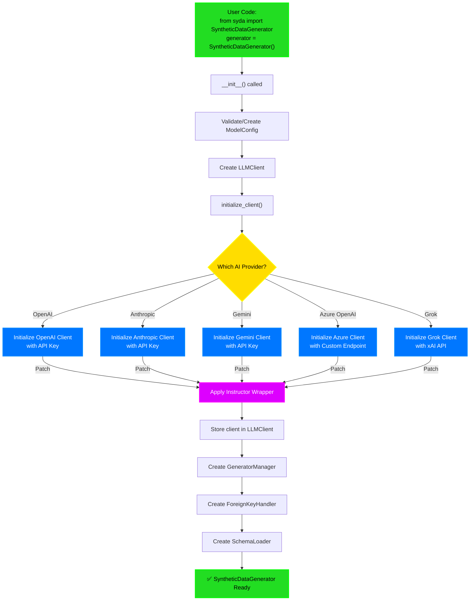

**What Happens:**
- **LLMClient** connects to your chosen AI provider
- **Instructor** patches the client for structured output
- **GeneratorManager** prepares custom data generators
- **SchemaLoader** gets ready to parse schemas

---

### **PHASE 2: Schema Input & Validation** 📋

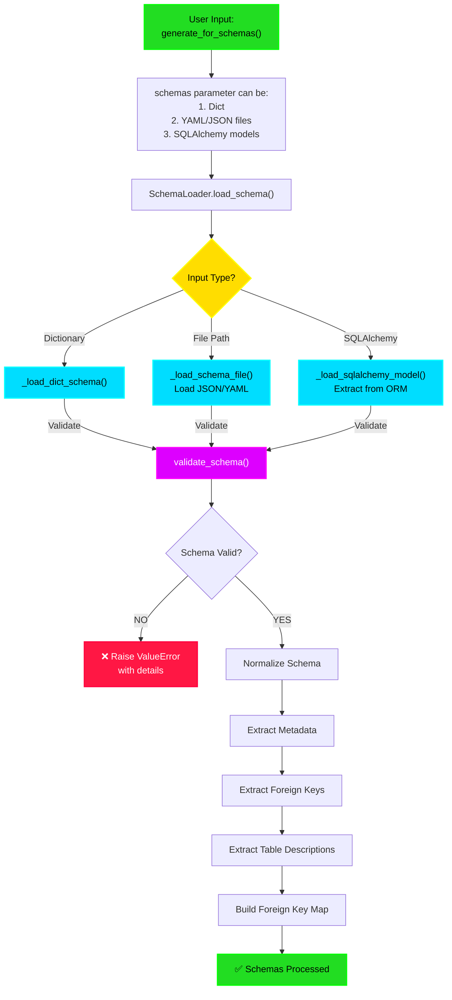

**Input Options (Production Use Cases):**
```python
# Option 1: Dictionary Schema
schemas = {
    'users': {'id': {'type': 'number'}, 'name': {'type': 'text'}},
    'orders': {'id': {'type': 'number'}, 'user_id': {'type': 'foreign_key'}}
}

# Option 2: YAML/JSON Files (Enterprise common)
schemas = {
    'users': 'schemas/users.yml',
    'orders': 'schemas/orders.json'
}

# Option 3: SQLAlchemy Models (ORM-based - Production common)
schemas = generate_for_sqlalchemy_models(
    sqlalchemy_models=[User, Order, Product],
    ...
)
```

---

### **PHASE 3: Dependency Analysis & Ordering** 🔗

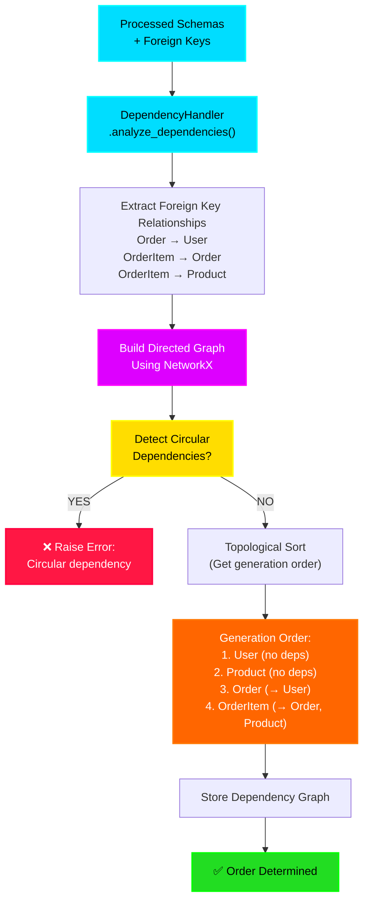

**Why This Matters:**
- ⚠️ Can't generate `Order` before `User` exists
- ⚠️ Can't generate `OrderItem` before `Order` and `Product` exist
- ✅ Graph ensures correct generation order EVERY TIME

---

### **PHASE 4: Data Generation Loop** 🎯

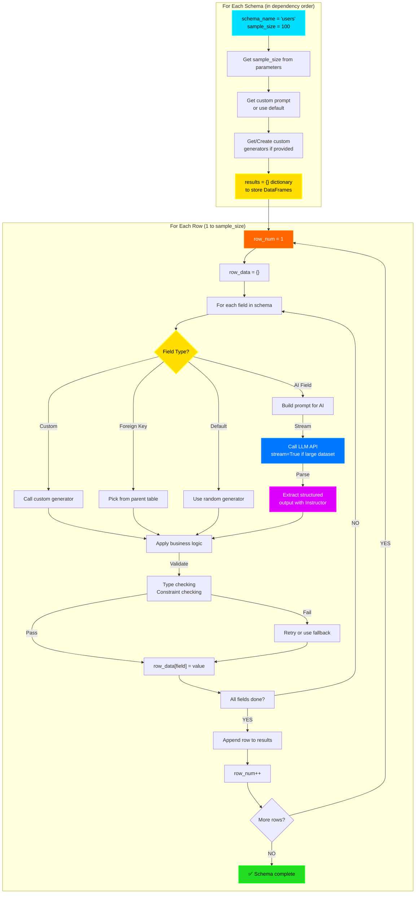

**Example: Generating 100 users**
```
Row 1: id=1, name="John", email="john@..."
Row 2: id=2, name="Sarah", email="sarah@..."
...
Row 100: id=100, name="Michael", email="michael@..."
```

---

### **PHASE 5: Foreign Key Integrity** 🔐

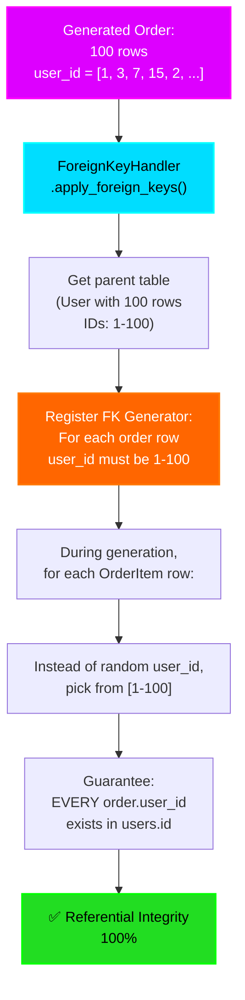

**Production Guarantee:**
- ❌ NEVER: `order.user_id = 999` when user 999 doesn't exist
- ✅ ALWAYS: All foreign keys point to valid records

---

### **PHASE 6: Output & File Storage** 💾

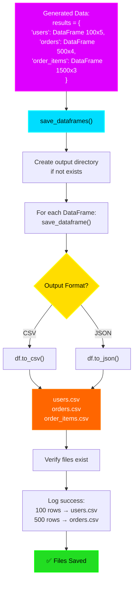

**CSV Output Example:**
```csv
# users.csv
id,name,email,created_at,is_active
1,John,john@example.com,2024-01-15,true
2,Sarah,sarah@example.com,2024-01-16,true
...

# orders.csv
id,user_id,total,status
1,1,150.99,completed
2,2,89.50,pending
...
```

---

## 🔄 Complete End-to-End Timeline

```mermaid
graph TD
    A["⏱️ 00:00<br/>User Code:<br/>Initialize generator"] --> B["⏱️ 00:05<br/>Setup ModelConfig"]
    B --> C["⏱️ 00:10<br/>Call generate_for_schemas()"]
    C --> D["⏱️ 00:15<br/>Library Init:<br/>Create LLMClient"]
    D --> E["⏱️ 00:20<br/>Connect to AI provider"]
    E --> F["⏱️ 00:25<br/>Initialize GeneratorManager"]
    F --> G["⏱️ 00:30<br/>Input Processing:<br/>Load schemas"]
    G --> H["⏱️ 00:35<br/>Validate schemas"]
    H --> I["⏱️ 00:40<br/>Normalize structures"]
    I --> J["⏱️ 00:45<br/>Dependency Analysis:<br/>Extract foreign keys"]
    J --> K["⏱️ 00:50<br/>Build dependency graph"]
    K --> L["⏱️ 00:55<br/>Determine generation order"]
    L --> M["⏱️ 01:00<br/>Data Generation:<br/>Generate Schema 1"]
    M --> N["⏱️ 02:00<br/>Generate Schema 2"]
    N --> O["⏱️ 03:00<br/>Generate Schema 3"]
    O --> P["⏱️ 04:30<br/>Generate Schema 4"]
    P --> Q["⏱️ 05:00<br/>Apply custom generators"]
    Q --> R["⏱️ 05:30<br/>Validate all data"]
    R --> S["⏱️ 06:00<br/>FK Validation:<br/>Check referential integrity"]
    S --> T["⏱️ 06:15<br/>Verify all FKs valid"]
    T --> U["⏱️ 06:30<br/>Output:<br/>Assemble DataFrames"]
    U --> V["⏱️ 06:45<br/>Save CSV files"]
    V --> W["⏱️ 07:00<br/>Log success messages"]
    W --> X["⏱️ 07:15<br/>Return results"]
    X --> Y["⏱️ 07:30<br/>Done:<br/>✅ User gets DataFrames"]
    
    style A fill:#22DD22,stroke:#00FF00,stroke-width:2px,color:#000000
    style D fill:#00DDFF,stroke:#00FFFF,stroke-width:2px,color:#000000
    style G fill:#DD00FF,stroke:#FF00FF,stroke-width:2px,color:#FFFFFF
    style J fill:#FF6600,stroke:#FF7700,stroke-width:2px,color:#FFFFFF
    style M fill:#FFDD00,stroke:#FFFF00,stroke-width:2px,color:#000000
    style S fill:#0077FF,stroke:#0088FF,stroke-width:2px,color:#FFFFFF
    style U fill:#FF6600,stroke:#FF7700,stroke-width:2px,color:#FFFFFF
    style Y fill:#22DD22,stroke:#00FF00,stroke-width:2px,color:#000000
```

---

## 📁 Production Module Responsibilities

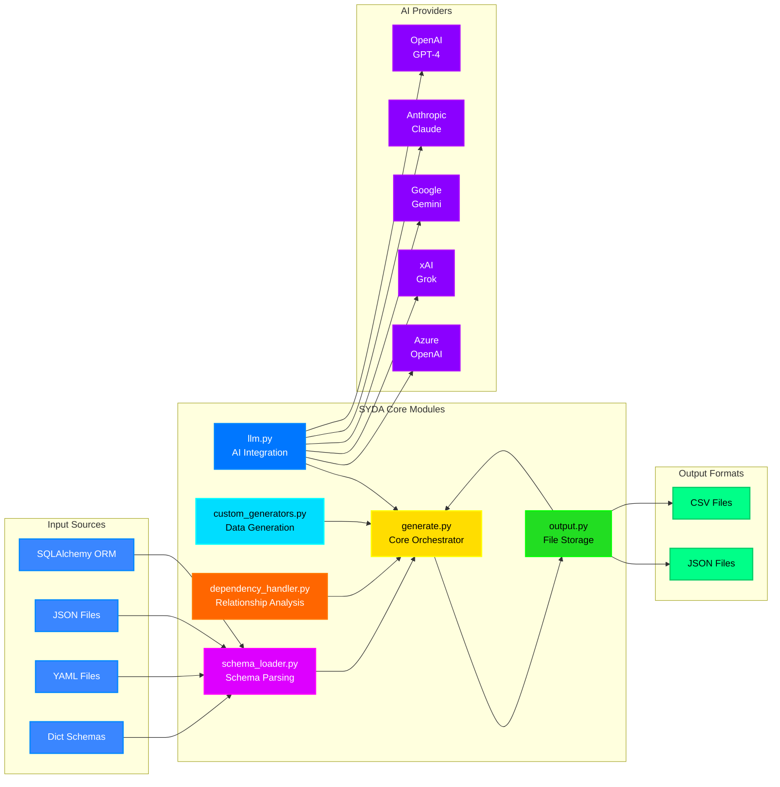

---

## 🚨 Error Handling & Recovery

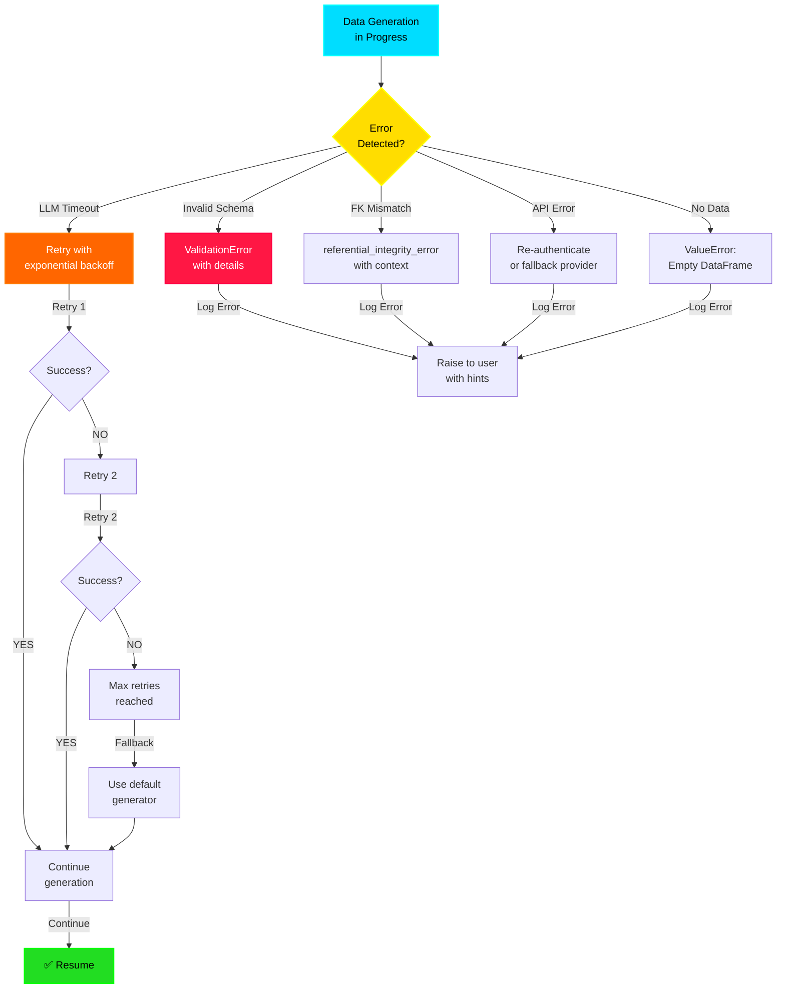

---

## 🎯 Production Configuration Options

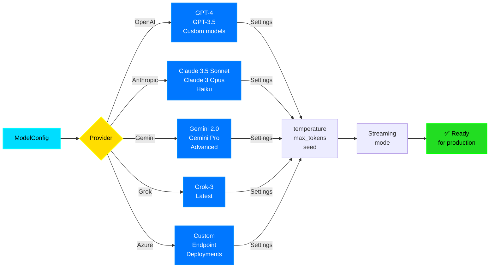

---

## 📊 Production Use Case Examples

### **Use Case 1: E-Commerce Dataset Generation** 🛒
```
Dependency Order:
1. Categories (100 rows) → No dependencies
2. Products (1000 rows) → FK to Categories
3. Customers (500 rows) → No dependencies
4. Orders (5000 rows) → FK to Customers
5. OrderItems (15000 rows) → FK to Orders, Products
6. Reviews (3000 rows) → FK to Products, Customers

Total: 24,600 rows with PERFECT referential integrity
All generated in ~5-10 minutes
```

### **Use Case 2: Healthcare Dataset (HIPAA Compliant)** 🏥
```
Dependency Order:
1. Patients (1000 rows) → No dependencies
2. Doctors (50 rows) → No dependencies
3. Hospitals (10 rows) → No dependencies
4. Appointments (5000 rows) → FK to Patients, Doctors, Hospitals
5. MedicalRecords (2000 rows) → FK to Patients, Doctors
6. Prescriptions (8000 rows) → FK to Patients, Doctors

Sensitive data NEVER exposed, fully synthetic
All referential integrity guaranteed
```

### **Use Case 3: Financial Dataset** 💰
```
Dependency Order:
1. Accounts (200 rows) → No dependencies
2. Customers (200 rows) → FK to Accounts
3. Transactions (10000 rows) → FK to Accounts
4. Cards (300 rows) → FK to Accounts
5. Disputes (50 rows) → FK to Transactions, Cards

Complex relationships handled automatically
All transactions reconcile perfectly
```

---

## ✅ Production Guarantees

| Guarantee | Implementation |
|-----------|-----------------|
| **Referential Integrity** | FK handler validates all foreign keys |
| **No Orphaned Records** | Dependency ordering ensures parent exists first |
| **Deterministic Output** | Optional seed parameter for reproducibility |
| **Type Safety** | Pydantic validation on all inputs |
| **Error Reporting** | Detailed error messages with suggestions |
| **API Resilience** | Retry logic with exponential backoff |
| **Multi-Provider** | Switch between AI providers without code change |
| **Scaling** | Handles thousands of rows efficiently |
| **Privacy** | No real data exposed, fully synthetic |
| **Extensibility** | Custom generators for business logic |

---

## 🎬 Quick Reference: Call Stack

```
User Code
  └─ generator.generate_for_schemas()
      ├─ SchemaLoader.load_schema()
      │   └─ validate_schema()
      ├─ DependencyHandler.analyze_dependencies()
      │   └─ Build NetworkX graph & topological sort
      ├─ For each schema (in dependency order):
      │   ├─ For each row:
      │   │   ├─ For each field:
      │   │   │   ├─ Check if FK → ForeignKeyHandler
      │   │   │   ├─ Check if custom → GeneratorManager
      │   │   │   └─ Otherwise → LLMClient.call_llm()
      │   │   │       └─ instructor.parse_response()
      │   │   └─ Append row to results
      │   └─ Apply foreign key constraints
      ├─ Validate referential integrity
      ├─ save_dataframes()
      │   └─ save_dataframe() for each table
      └─ Return results dictionary
```

---

That's the complete production-grade SYDA flow! 🚀

